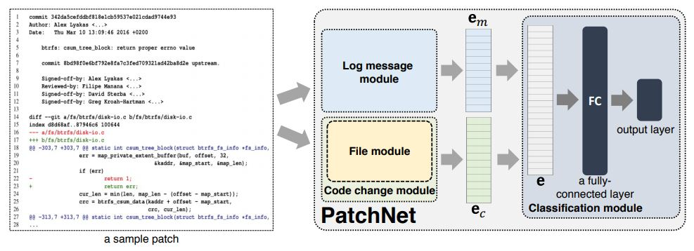
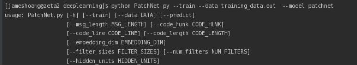

# PatchNet: A Tool for Deep Patch Classfication [[pdf](https://arxiv.org/pdf/1903.02063.pdf)]
The figure belows illustrate our tool:

First time setup
----------------
Please install the neccessary libraries before running our tool:
   
- python 2.7 (https://www.anaconda.com/download/#linux)

- tensorflow 1.4.1 (https://www.tensorflow.org)

- numpy 1.14.3 (https://www.numpy.org)

- scikit-learn 0.19.1 (https://scikit-learn.org/stable/)

Dataset details
----------------

* The dataset is put in the folder ./data, namely "newres_funcalls_jul28.out", containing 82,403 patches. 

Hyperparameters:
----------------
We have five different parameters:

* --data_type: Type of data (log messages, code change, or both) used to construct a model. Default: both.
* --embedding_dim: Dimension of embedding vectors. Default:32
* --filter_sizes: Sizes of filters used by the convolutional layers. 
* --num_filters: Number of filters. Default: 32.
* --hidden_layers: Number of hidden layers. Default: 16.
* --dropout_keep_prob: Dropout for training PatchNet. Default: 0.5.
* --l2_reg_lambda: Regularization rate. Default: 1e-5.
* --learning_rate: Learning rate. Default: 1$e-$4.
* --batch_size: Batch size. Default: 64. 
* --num_epochs: Number of epochs. Default: 25. 

Running the model
----------------
In the training phase, simply run this command to train the network: 

	$ python PatchNet.py --train --data training_data.out --model patchnet

In the testing phase, run this command to get a list of predicted scores: 

	$ python PatchNet.py --predict --data test_data.out --model patchnet
	
To modify the hyperparameters, please follow the example below:

	$ python PatchNet.py --train --data data.out --model patchnet --embedding_dim 128  --filter_sizes "1,2" --num_filters 64

Example output: 
----------------

